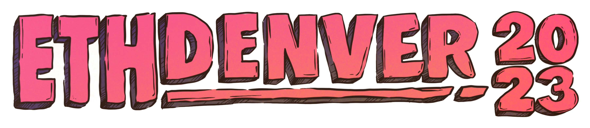

# Intro to Layer 2s: buidl on the zkEVM _(pre ETH Denver edition)_



This repository contains all the code examples used in the "Introduction to L2s" workshop previous to ETH Denver. 

🎬 [Watch the recording here](https://www.youtube.com/watch?v=8oBbIjgT5mM)

Slides are available here: https://docs.google.com/presentation/d/1_zWQRjUFX5ahiBMOjnoDiMAdjJ2-ozCs593HRCwflHU/edit?usp=sharing

> This repo is no longer open to contributions & PRs.

## Project structure

Projects created with the zkSync-CLI have the following structure.

- `/contracts`: smart contracts.
- `/deploy`: deployment and contract interaction scripts.
- `/test`: test files
- `hardhat.config.ts`: configuration file.

## Commands

- `yarn hardhat compile` will compile the contracts.
- `yarn hardhat deploy-zksync --script scriptFILE.ts` will execute the script from the `/deploy` folder (e.g `yarn hardhat deploy-zksync --script deploy-greeter.ts`). Requires [environment variable setup](#environment-variables).

### Environment variables

In order to prevent users to leak private keys, this project includes the `dotenv` package which is used to load environment variables. It's used to load the wallet private key, required to run the deploy script.

To use it, rename `.env.example` to `.env` and enter your private key.

```
WALLET_PRIVATE_KEY=123cde574ccff....
```

## Workshop tasks


### Workshop important links

- [zkSync Portal](https://portal.zksync.io/)
- [zkSync official faucet](https://portal.zksync.io/faucet)
- [Goerli faucet](https://goerlifaucet.com/)
- [zkSync explorer](https://goerli.explorer.zksync.io/)
- [zkSync CLI documentation](https://v2-docs.zksync.io/api/tools/zksync-cli/)
- [OpenZeppelin wizzard](https://wizard.openzeppelin.com/#erc20)

### 1. zkSync portal and faucets

The [zkSync Portal](https://portal.zksync.io/) is the easiest way to deposit and withdraw funds from zkSync. If you have GoerliETH, you can use the [bridge section](https://portal.zksync.io/bridge) to deposit or withdraw funds to and from the zkSync testnet.

However, if you don't have any GoerliETH, you can receive a small amount by using our [faucet](https://portal.zksync.io/faucet), which requires you to post a tweet as a way to verify your identity.

On the other hand, here are a few other faucets that you can use to get GoerLiETH, which then you can bridge to zkSync:

- [Alchemy faucet](https://goerlifaucet.com/)
- [PoW faucet](https://goerli-faucet.pk910.de/)

### 2. Create a project with zksync-cli

The zkSync CLI tool is the easiest way to start developing applications and smart contracts on zkSync. You can [find the documentation here](https://v2-docs.zksync.io/api/tools/zksync-cli/).

To install it, just run `sudo npm i -g zksync-cli@latest` (enter your system password).

To create a new project, just run `zksync-cli create NAME_OF_YOUR_PROJECT`. This will create a new folder with the project name and download a sample project inside it.

**Note** Once created, run `cd NAME_OF_YOUR_PROJECT` to enter the project directory. You'll have to run the commands to compile contracts and run scripts from this folder.

The project created is very similar to any other Hardhat project, but the `hardhat.config.ts` file includes some zkSync-specific properties.

First, it imports a few dependencies used to compile and deploy our contracts:

```typescript
import "@matterlabs/hardhat-zksync-solc";
import "@matterlabs/hardhat-zksync-deploy";
```

Secondly, it includes the `zksolc` object which contains specific properties of the compiler. It comes with the minimal configuration but you can learn more about the [zksolc configuration here](https://v2-docs.zksync.io/api/hardhat/plugins.html#hardhat-zksync-solc).

```js
zksolc: {
  version: "1.2.2",
  compilerSource: "binary",
  settings: {},
},
```

An last, the networks are defined with the following parameters:

```js
  url: "https://zksync2-testnet.zksync.dev",
  ethNetwork: "goerli",
  zksync: true,
```

The `url` and `ethNetwork` are the RPC endpoints of the L2 and L1 and the `zksync` flag is used to indicate Hardhat if it should use the zksync compiler and deployment plugins.

**Note** With "goerli", the project will use the default providers from ethers, but you can change that for an RPC endpoint from

### 3. Deploy and verify the `Greeter` contract

The zkSync-CLI sample project includes a `Greeter` contract and a deploy script. The [`Greeter` contract](./contracts/Greeter.sol) stores a message on chain which can be retrieved by calling the read method `greet()` and can be updated by calling the method `setGreeting(_message)`.

To compile the contract, run `yarn hardhat compile`. You'll notice that the folders `artifacts-zk` and `cache-zk` will be created with the compiled artifact.

To deploy the contract, just set your wallet's private key in the `.env` file (you'll have to rename it first), and run the command `yarn hardhat deploy-zksync --script deploy-greeter.ts`.

To verify the contract you can use the [zkSync Explorer](https://goerli.explorer.zksync.io/). You'll have to select the solidity and zksolc compiler versions to match the ones from the [`hardhat.config.ts` file](./hardhat.config.ts) and also enter the constructor params, which are printed in the terminal by the [`deploy-greeter.ts` script](./deploy/deploy-greeter.ts).

**Note** Make sure you've configured your private key in the `.env` file [as described above](#environment-variables).

### 4. Create and deploy an ERC20 contract

To showcase the compatibility with the standard token contract, we'll use the [OpenZeppeling contract wizard](https://wizard.openzeppelin.com/#erc20) to create an ERC20 contract.

We'll choose an ERC20, Burnable, Pausable and Snapshot. We can copy the contract code and the contract and put it in the `contracts` folder as is (check out file [zkToken.sol](./contracts/zkToken.sol)).

As this contract uses some dependencies from OpenZeppelin, we'll have to install them with `yarn add -D @openzeppelin/contracts`.

To compile the contract, just run `yarn hardhat compile` again.

- The included [`deploy-erc20.ts`](./deploy/deploy-erc20.ts) script will deploy this contract.
- The included [`use-erc20.ts`](./deploy/use-erc20.ts) script will do a transfer of tokens between two accounts and return its balances.

**Note** To verify contracts that include imports of other contracts and libraries (like Openzeppelin contracts 😉), you'd need to flatten it first! Learn more about [flattening contracts in our docs](https://v2-docs.zksync.io/api/tools/block-explorer/contract-verification.html#verifying-contracts-using-the-zksync-block-explorer)

### 5. Create and deploy an ERC721 contract

To showcase the compatibility with the standard NFT token, we'll use the [OpenZeppeling contract wizard](https://wizard.openzeppelin.com/#erc721) to create an ERC721 contract.

We'll select the following options: Mintable (with auto increments), Burnable, Enumerable and enter a Base URI. We can copy this contract into the `/contracts` folder (check out file [zkNFT.sol](./contracts/zkNFT.sol)).

To compile the contract, just run `yarn hardhat compile` again.

- The included [`deploy-erc721.ts`](./deploy/deploy-erc721.ts) script will deploy this contract.
- The included [`use-erc721.ts`](./deploy/use-erc721.ts) script will mint a new NFT and return the total supply and balance.


## Official Links

- [Website](https://zksync.io/)
- [Documentation](https://v2-docs.zksync.io/dev/)
- [GitHub](https://github.com/matter-labs)
- [Twitter](https://twitter.com/zksync)
- [Discord](https://discord.gg/nMaPGrDDwk)
